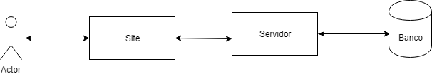

# Tecnologias usadas no projeto

* Front end: Angular
* Back end: .NET
* Banco: Postgresql

# Arquitetura do projeto

# INSTRUÇÕES 

O Hospital universitário contratou a sua empresa para informatizar o processo de solicitação de exames e emissão de laudos para o serviço de cardiologia. Sendo assim, foi fornecido os seguintes requisitos:

Na empresa há vários papéis atribuídos aos médicos, são eles: residentes – uma modalidade de ensino de pós-graduação destinada a médicos, na forma de cursos de especialização, docentes – são professores da universidade e responsável pelo processo de ensino e aprendizado e os demais são denominados médicos.

Todo médico tem um nome e um número do CRM, porém os docentes devem conter um atributo que identifique a sua titulação na universidade, já os residentes devem conter um atributo que identifique o ano de sua residência.

Qualquer um dos médicos pode emitir um pedido de exame, para isso deve informar o registro do paciente. A partir daí, o programa acessa o sistema de registro de pacientes de onde são recuperados seus dados pessoais (nome, sexo, cor e idade do paciente), onde a idade é calculada em função de sua data de nascimento. Em seguida, o médico seleciona um exame por pedido (ecocardiograma, eletrocardiograma, mapa ou holter), o médico informa uma data prevista para realização do exame, o médico informa a hipótese diagnóstica que deve ser baseada no códico CID10; por fim, solicita a emissão do pedido e o sistema salva e imprime o pedido de exame, que é entregue ao paciente.

No pedido de exame impresso devem constar nome, sexo, idade e data prevista da realização, o nome do exame e as recomendações – por exemplo, não comer uma hora antes do exame.

Os residentes realizam os exames fazendo uso de equipamentos específicos para cada tipo de exame; ao final de cada um, os equipamentos geram numa pasta predefinida o resultado do exame em arquivo no formato PDF. A partir dai e por meio de um módulo do sistema, os residentes poderão registrar a data e hora em que o exame foi realizado e fazer o upload do arquivo PDF para o sistema. O sistema não deve permitir a inclusão de arquivos com extensão diferente de PDF e tamanho acima de 200kb.

Após o registro do exame, o mesmo residente ou outro qualquer, por meio de um módulo do sistema, deve interpretar as imagens ou os traçados contidos no arquivo e emitir o laudo, ou seja, digitar uma breve descrição e informar uma conclusão que, assim como a hipótese diagnóstica, é baseada no código internacional de doenças (CID). O sistema atribui a emissão do laudo ao residente conectado no sistema.

Após 24horas, os exames não realizados terão seus pedidos cancelados, sendo assim, alguns pedidos de exames não conterão laudos.

Os laudos emitidos pelos residentes permanecem com o status de provisório, não podendo ser consultado pelo médico.

Caberá ao docente revisar cada laudo emitido pelo residentes e aprovar ou modificar.

Após aprovado os médicos passam a ter acesso ao laudo.

O sistema deve usar banco de dados open-source gratuito.

